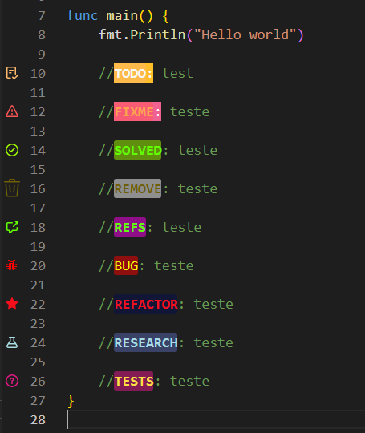

# TODO Tree config Vscode example

Example of configuration your vscode with a pretty comment for archives and commits.

## Versioning and license

Our version numbers follow the [semantic versioning specification](http://semver.org/). You can see the available versions by checking the [tags on this repository](https://github.com/thiagozs/todo-tree-cfg/tags). For more details about our license model, please take a look at the [LICENSE](LICENSE) file.

2022, thiagozs